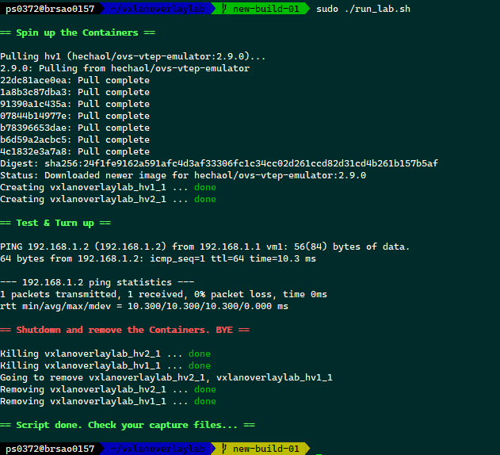
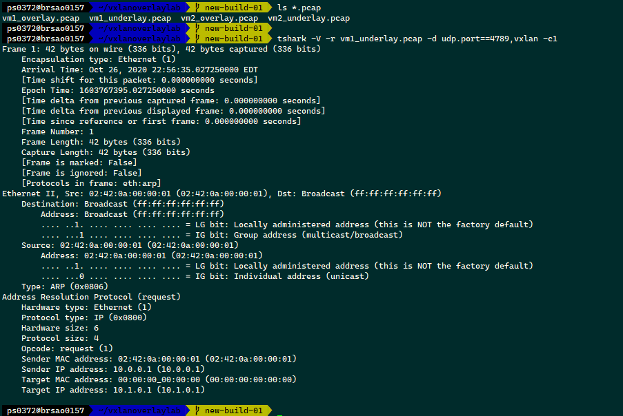

# vxlan-overlay-lab

See original @ [VXLAN Hands on Lab](http://hechao.li/2018/05/15/VXLAN-Hands-on-Lab/)

## Prerequisite 
* docker-ce
* docker-compose
* tshark (CentOS/RHEL: wireshark)

## Run
```bash
$ sudo ./run_lab.sh
```

## Build screenshot



## Collect PCAP file
After running `run_lab.sh`, the PCAP files are generated and copied to working directory
```bash
$ ls *.pcap
vm1_overlay.pcap  vm1_underlay.pcap vm2_overlay.pcap  vm2_underlay.pcap
```

## Analyzing capture


